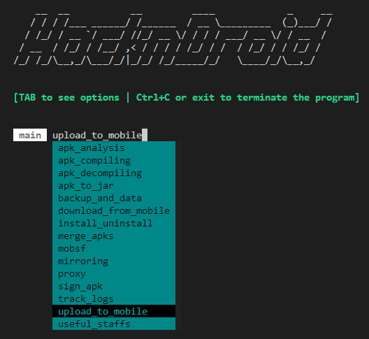
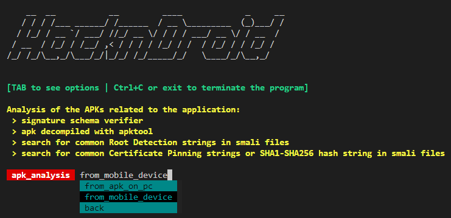
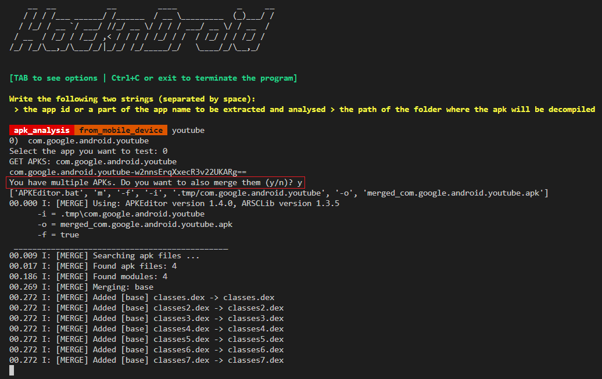

# HacknDroid
The script is used for the automation of some MAPT activities and the interaction with the mobile Android device. The script was created to solve many problems:
- the command `adb root` is not enabled after device rooting on many production mobile devices;
- the files need to be shared before on the external SD Card and then on the device;
- the retrieving of the application data (APKs, Shared preferences, Stored data) needs to be found and retrieved with several commands;
- the unpacking process of the application APK need a merge phase for application with multiple APKs in `/data/app/{app_id}_{base64_unique_id}` for efficency purpouses

---

## Pre-requisites
Install the following programs and add their folder with binary files in the `PATH` environment variable:
- [***ADB***](https://developer.android.com/tools/adb) for interaction with the mobile device in Developer Mode;
- [***scrcpy***](https://github.com/Genymobile/scrcpy) for mirroring and remote control of the mobile device over ADB connection;
- [***JADX***](https://github.com/skylot/jadx) to explore source obtained from the decompiled code from the APK;
- [**Apktool**](https://apktool.org/) to compile and decompile APKs;
- [**APKEditor**]() to merge APKs.
- [**ABE**](https://github.com/nelenkov/android-backup-extractor) Android Backup Extractor to create TAR from Android Backup.

### APKEditor and Apktool
For the following programs, create the wrapper to call the program without writing `java -jar`.
As described for Apktool [here](https://apktool.org/docs/install), rename the tools JAR files as:
- `apktool.jar`
- `APKEditor.jar`
- `abe.jar`

Create a wrapper for both the JAR files.
For APKEditor and ABE, you can create one of the following wrappers depending on the Operating System:
- Windows (`APKEditor.bat`)
```bash
@echo off
setlocal

REM Set the path to your APKEditor.jar
set APKEDITOR_P="C:/Windows/APKEditor.jar"

REM Run APKEditor.jar
java -jar %APKEDITOR_P% %*

endlocal
```

Insert the wrapper and the JAR in one of the paths registered in the `PATH` environment variable (e.g. `C:\Windows\`).

- UNIX-based systems (`APKEditor`)
```bash
$APKEDITOR_PATH = "./APKEditor.jar"
java -jar $APKEDITOR_PATH "$@"
```
Insert the wrapper and the JAR in `/usr/local/bin`.

## Install
Install python requirements using the following command:
```bash
pip install -r requirements.txt
```

---

## Run the program
```bash
python main.py
```





---

## Script features
- [ ] `apk_analysis`<br>Analysis of the APKs (signature schema verifier, apk decompiling, search for common Root Detection, Certificate Pinning, SHA1-SHA256 strings in smali files, etc.)
  - [ ] `from_apk_on_pc`
  - [ ] `from_mobile_device`
- [x] `apk_compiling`<br>Compile an APK file from the folder with decompiled and modified code
  - [x] `compile`: Compile an apk file from the folder with decompiled and modified code
  - [x] `compile_and_sign`: Compile and sign an apk file from the folder with decompiled and modified code
- [x] `apk_decompiling`<br>Decompile an APK file
  - [x] `from_apk_on_pc`: 
  - [x] `from_mobile_device`: 
- [x] `apk_to_jar`<br>>Convert the apk to a jar file
  - [x] `from_apk_on_pc`: 
    - [x] `create_jar_file`: 
    - [x] `jadx_create_and_open_file`: 
  - [x] `from_mobile_device`: 
    - [x] `create_jar_file`: 
    - [x] `jadx_create_and_open_file`: 
- [x] `backup_and_data`<br>Backup the mobile device or an application
  - [x] `backup_device`: Backup the mobile device
  - [x] `backup_specific_app`: Backup a specific app specifing its app ID
  - [x] `backup_restore`: Specify the backup file path on your system
  - [x] `backup_to_folder`: Convert the AB file to an unpacked folder
  - [x] `reset_app_data`: Reset App data
- [x] `download_from_mobile`<br>Download file from the mobile device
- [x] `install_uninstall`<br>Install/Uninstall an app on the mobile device
  - [x] `install_from_apk`
  - [x] `install_from_playstore`
  - [x] `uninstall`
- [x] `merge_apks`<br>Merge several APKs using APKEditor
  - [x] `from_directory`
  - [x] `from_list`
- [ ] `mobsf`<br>Static Analysis of the APK using MobSF
  - [ ] `from_apk_on_pc`
  - [ ] `from_mobile_device`
- [ ] `mirroring`<br>Launch scrcpy for mobile device mirroring
- [x] `proxy`<br>Set global proxy on the mobile device
  - [x] `get_current_proxy`
  - [ ] `install_certificates`
  - [x] `set_proxy_with_current_ip`
  - [x] `set_proxy_with_other_ip`
  - [x] `del_proxy`
- [x] `sign_apk`<br>Sign an apk on your PC. Write the path of the apk you want to test
- [ ] `track_logs`<br>Logs gathering
  - [x] `all_logs`
  - [ ] `all_crash_logs`
  - [x] `app_logs`
  - [ ] `app_crash_logs`
- [x] `upload_to_mobile`<br>Upload a file from PC to mobile device
- [ ] `useful_staffs`
  - [x] `battery_saver`: Battery Saver mode (ON/OFF)
  - [x] `do_not_disturb_mode`: Do Not Disturb mode (ON/OFF)
  - [x] `connectivity`: Connectivity options management
    - [x] `wifi`: Wifi option Management (ON/OFF)
    - [x] `airplane`: Airplane mode Management (ON/OFF)
  - [ ] `screenshot_video`: Screenshot/Video on the mobile device
    - [ ] `screenshot`
    - [ ] `video`
  - [ ] `reboot`<br>Reboot the device with several options
    - [ ] `reboot`: Reboot the mobile device
    - [ ] `reboot_recovery`: Reboot the mobile device in recovery mode
    - [ ] `reboot_bootloader`: Reboot the mobile device in bootloader mode
