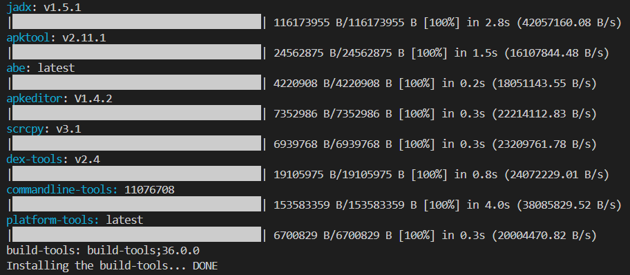
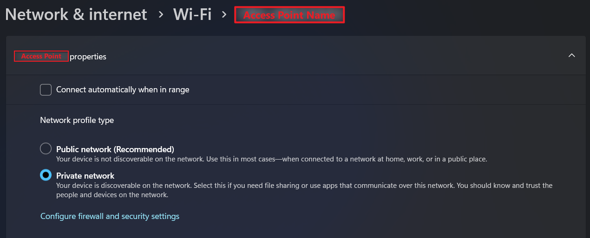
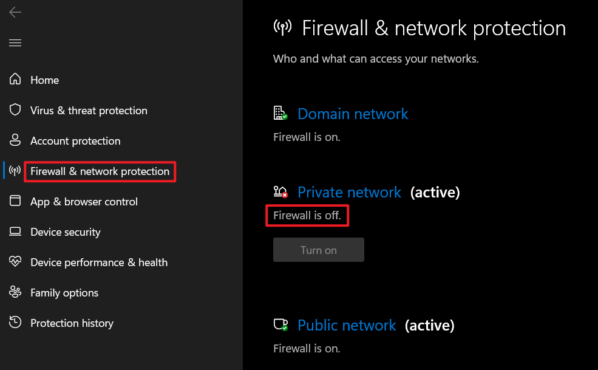
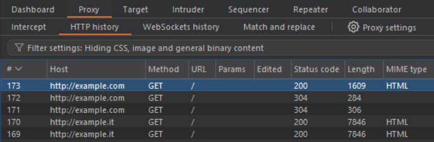

# HacknDroid
The script is used for the automation of some MAPT activities and the interaction with the mobile Android device. The script was created to solve many problems:
- the command `adb root` is not enabled after device rooting on many production mobile devices;
- the files need to be shared before on the external SD Card and then on the device;
- the retrieving of the application data (APKs, Shared preferences, Stored data) needs to be found and retrieved with several commands;
- the unpacking process of the application APK need a merge phase for application with multiple APKs in `/data/app/{app_id}_{base64_unique_id}` for efficency purpouses

Detailed list of available functionalities can be found [here](#script-features).

---

## Install
Install python requirements using the following command:
```bash
pip install -r requirements.txt
```
Install other binary requirements:
```bash
python3 hackndroid.py --install
```


---

## Run the program
```bash
python hackndroid.py
```


<details>
<summary><i><b>Proxy via DNS Spoofing (on Windows)</b></i></summary>
<p>To run DNS Server using the tool, ensure that the Windows Firewall is disabled on the PC where the script will be run:</p><br>
<br>
<br>

If everything was set successfully, you can intercept the traffic on ports 80, 443 in Burp Suite as follows:
<br>
</details>

---

## Script features
### Task Manager
- ***Daemon tasks***
  - logcat
  - mirroring
  - proxy with dns spoofing
  - video recoding
- ***Sequential tasks***

### Functionalities
- `apk_analysis`<br>Analysis of the APKs (apk decompiling, search for common Root Detection, Certificate Pinning, SHA1-SHA256 strings in the files)
  - `from_apk_on_pc`
  - `from_mobile_device`
- `app_info`
  - `from_apk_on_pc`
  - `from_mobile_device`
- `apk_compiling`<br>Compile an APK file from the folder with decompiled and modified code
  - `compile`: Compile an apk file from the folder with decompiled and modified code
  - `compile_and_sign`: Compile and sign an apk file from the folder with decompiled and modified code
- `apk_decompiling`<br>Decompile an APK file
  - `from_apk_on_pc`: 
  - `from_mobile_device`: 
- `apk_to_jar`<br>Convert the apk to a jar file
  - `from_apk_on_pc`: 
    - `create_jar_file`: 
    - `jadx_create_and_open_file`: 
  - `from_mobile_device`: 
    - `create_jar_file`: 
    - `jadx_create_and_open_file`: 
- `backup_and_data`<br>Backup the mobile device or an application
  - `backup_device`: Backup the mobile device
  - `backup_specific_app`: Backup a specific app specifing its app ID
  - `backup_restore`: Specify the backup file path on your system
  - `backup_to_folder`: Convert the AB file to an unpacked folder
  - `reset_app_data`: Reset App data
- `download_from_mobile`<br>Download file from the mobile device
- `install_uninstall`<br>Install/Uninstall an app on the mobile device
  - `install_from_apk`
  - `install_from_playstore`
  - `uninstall`
- `merge_apks`<br>Merge several APKs using APKEditor
  - `from_directory`
  - `from_list`
- `mirroring`<br>Launch scrcpy for mobile device mirroring
- `proxy`<br>Set global proxy on the mobile device
  - `system_proxy`
    - `get_current_proxy`
    - `set_proxy_with_current_ip`
    - `set_proxy_with_other_ip`
    - `del_proxy`
  - `invisible_proxy`
    - `ip_tables`
      - `get_current_proxy`
      - `set_proxy_with_current_ip`
      - `set_proxy_with_other_ip`
      - `del_proxy`
    - `dns`
      - `get_current_proxy`
      - `dns_server_with_current_ip`
      - `dns_server_with_another_ip`
- `sign_apk`<br>Sign an apk on your PC. Write the path of the apk you want to test
- `track_logs`<br>Logs gathering
  - `all_logs`
  - `all_crash_logs`
- `upload_to_mobile`<br>Upload a file from PC to mobile device
- `useful_staffs`
  - `device_info`
    - `apps_list`
      - `3rd_party_apps`: Get list of all the installed 3rd-party apps
      - `system_apps`: Get list of all the installed system apps
    - `cpu_info`: Get CPU information
    - `general_info`: Get mobile device general information
    - `ram_info`: Get RAM information
    - `storage_info`: Get Storage information
  - `battery_saver`: Battery Saver mode (ON/OFF)
  - `do_not_disturb_mode`: Do Not Disturb mode (ON/OFF)
  - `connectivity`: Connectivity options management
    - `wifi`: Wifi option Management (ON/OFF)
    - `airplane`: Airplane mode Management (ON/OFF)
  - `screenshot_video`: Screenshot/Video on the mobile device
    - `screenshot`
    - `video`
  - `shutdown`<br>Shutdown/Reboot the device with several options
    - `shutdown`: Shutdown the mobile device
    - `reboot`: Reboot the mobile device
    - `reboot_recovery`: Reboot the mobile device in recovery mode
    - `reboot_bootloader`: Reboot the mobile device in bootloader mode

---

### Tested on
- [x] Windows
- [ ] Linux
- [ ] MacOS

---

### Future functionalities
***Task management***
- [ ] Modular selection of paths where operations are performed
- [ ] Executable creation
- [ ] Not interactive execution
- [ ] Web interface (Flask)
- [ ] GUI
- [ ] Emulator Management

***Functionalities***
- [ ] `apk_analysis`
  - [ ] Signature scheme analysis, exported properties
  - [ ] `specific_technology`
    - [ ] Cordova
    - [ ] Flutter
- [ ] `system_mount_for_root`: Device rooting
  - [ ] Android <=10
  - [ ] Android 10+
- [ ] `install_certificates`
    - [ ] install depending on android
      - [ ] Android <=10
      - [ ] Android 10+
    - [ ] Install without Rooted device
      - [ ] MDM install 
      - [ ] install certificates on user land and modify android manifest
      - [ ] VPN certificate in userland
- [ ] `frida`: Use Frida for several functionalities
  - [ ] `function_hooking`
  - [ ] `script`